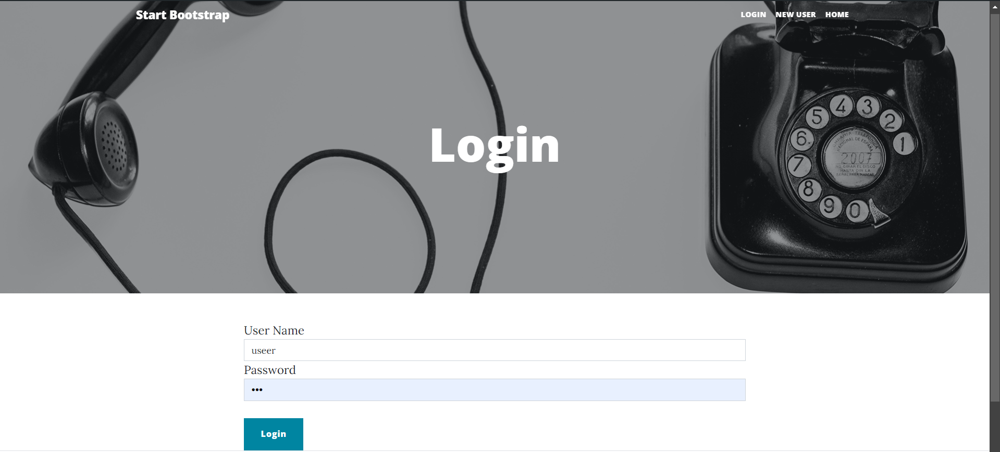

# Blog Web Page

This is a simple blog web page built using Node.js, Express.js, and MongoDB. It allows users to register for an account, log in, and manage blog posts. Registered users can create new posts, view their own and others' posts, and upload images with each post. The blog features user authentication for secure access, with passwords securely stored using hashing. Images uploaded by users are handled using Multer, and MongoDB is used as the database to store user data and blog posts.

The goal of this project is to provide a functional platform where users can share their thoughts and ideas through blog posts.

## Features

- User Registration
- Login/Logout
- Create, View, and Delete Posts
- View Others' Posts
- Upload Images
- MongoDB with Mongoose for Data Storagepage.

### Technologies:

- <h3>Node.js</h3>: Backend
- <h3>Mongoose</h3>: Database ORM for MongoDB
- <h3>Multer</h3>: Image Upload Handling
- <h3>Express.js</h3>: Web Framework
- <h3>EJS</h3>: Templating Engine

## How to Run

1. **Clone the repository:**

   ```bash
   git clone git@github.com:Muhammad-Ayman/blog.git

   ```

2. Install dependencies:

   ```bash
   npm install

   ```

3. Setup .env file for environment variables (e.g., MongoDB URI, JWT secret).

4.Start the server:

```bash
npm start

```

### how to use

- Register an account.
- Login to post or view posts.
- Upload images when creating a post.

### samples:





